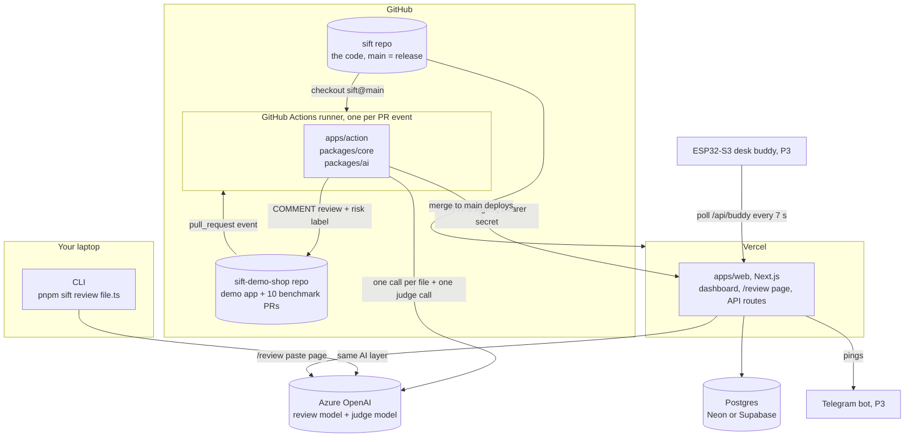
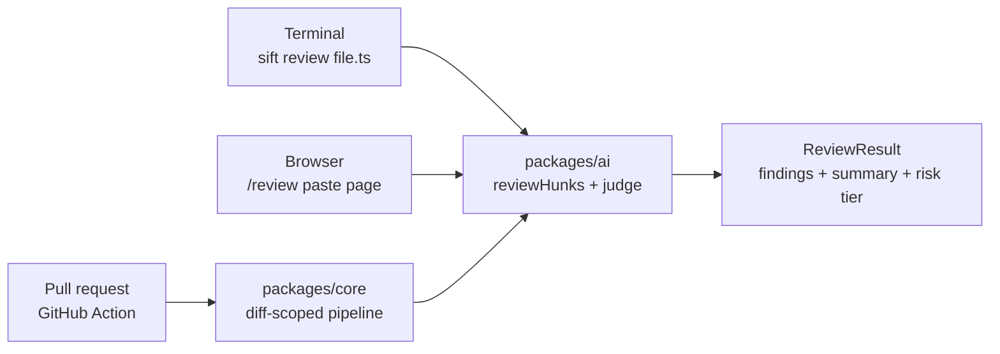
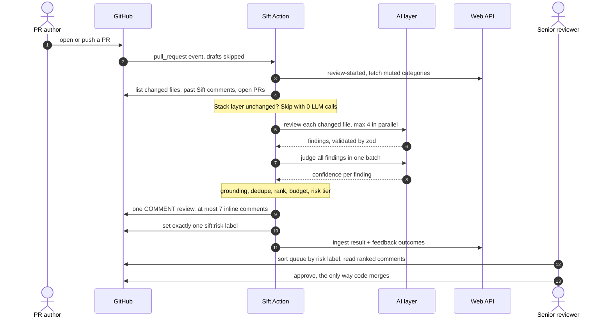
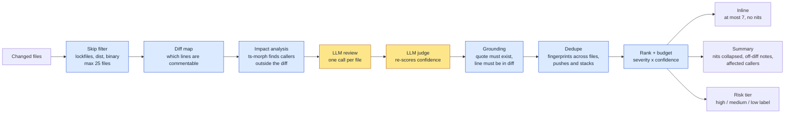
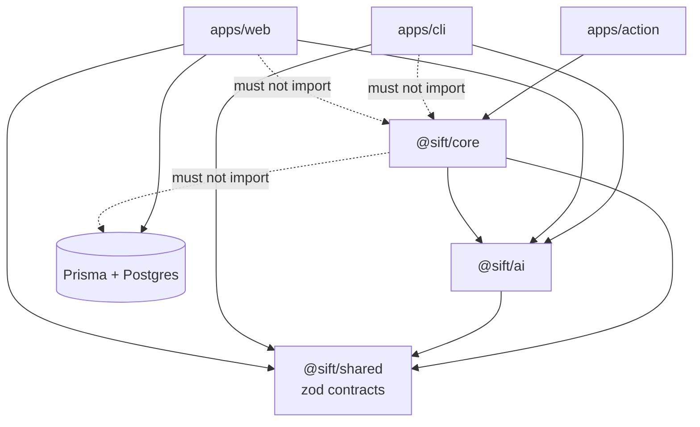
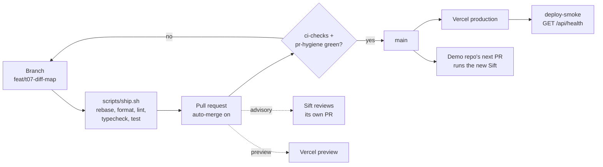

# Sift

**The AI pull-request reviewer that measures its own noise.**

Sift reviews a code file or a pull request and gives friendly, specific feedback on bugs, unclear names and style, plus an overall summary. On PRs it:

- comments only on changed lines;
- ranks findings by severity, with at most 7 inline comments;
- suppresses duplicates across files, pushes and stacked PRs;
- labels every PR by risk, so senior reviewers know where to start.

A human is always the required approver.

Built for **Microsoft Innovate 2026 · Problem 8: The Review-Queue Bottleneck**.

---

## Architecture at a glance

The deep reference is [docs/ARCHITECTURE.md](docs/ARCHITECTURE.md). This section is the visual tour: where each piece runs, how a pull request flows through Sift, and how code reaches production.

### 1. Where everything runs



| Piece | Runs on | Deployed how | Owns |
|---|---|---|---|
| `apps/action` + `packages/core` + `packages/ai` | GitHub Actions runner (Ubuntu), started per PR event | Nothing to deploy: the target repo's workflow checks out `sift@main` on every run | The review pipeline, GitHub comments and labels |
| `apps/web` | Vercel (serverless Next.js) | Vercel Git integration: preview per PR, production per merge to `main` | The database, dashboard, `/review` page, all API routes |
| Postgres | Neon or Supabase | `prisma migrate deploy` inside the Vercel build | Reviews, findings, outcomes, per-category precision |
| Model | Azure OpenAI (swappable via env) | Configured by env vars only | Nothing: stateless |
| `apps/cli` | Your laptop | Run from the repo with `pnpm sift` | Nothing: prints to the terminal |
| Buddy firmware (P3) | ESP32-S3 on your desk | `pio run -t upload` over USB | Nothing: renders the mood the server sends |

### 2. Three ways in, one AI layer



Single-file review (CLI and paste page) skips the PR machinery. PR review wraps the same AI call in the deterministic pipeline below.

### 3. The life of a pull request



Sift can only comment. It never approves, requests changes or merges; branch protection on the target repo requires one human approval.

### 4. Inside the pipeline: how noise gets filtered



Yellow steps call the model. Blue steps are plain, unit-tested code, which is why Sift cannot comment off the diff, repeat itself or exceed its budget.

### 5. Package boundaries



`pnpm check:boundaries` fails CI on any dotted edge. Only `apps/web` touches the database; the Action reaches it over HTTP, so a down API never blocks a review.

### 6. How code ships



### 7. Where the data lives

| Data | Source of truth | Read by |
|---|---|---|
| Posted comments, risk labels, dedupe fingerprints | GitHub (hidden `<!-- sift:fp=… -->` markers in comments) | The Action, on the next push |
| Reviews, findings, accepted/dismissed outcomes, precision | Postgres, via `apps/web` | Dashboard, Telegram, buddy, Action (muted categories) |
| Mined conventions (P3) | `.github/copilot-instructions.md` in the target repo | Sift and GitHub Copilot |
| Benchmark ground truth | `benchmark/labels.json`, committed before any run | `pnpm bench` |

---

## Quick start

```bash
corepack enable
pnpm install
cp .env.example .env               # add model provider keys
pnpm sift review path/to/file.ts
```

## How work ships (solo)

```bash
git checkout -b feat/t07-diff-map                        # one ticket from docs/TASKS.md
# ...code...
scripts/ship.sh "feat(core): add diff map of commentable lines"
```

`ship.sh` rebases, runs every check locally, pushes, opens the PR and turns on auto-merge. The PR squash-merges itself when CI is green.

- `main` is protected: direct pushes are rejected, even for admins.
- Merging to `main` **is** the release. Vercel deploys the web app, a smoke check hits `/api/health`, and the demo repo's Action runs Sift from `main` on its next PR.

Full rules: [CONTRIBUTING.md](CONTRIBUTING.md). Agent rules: [AGENTS.md](AGENTS.md).

## Workflows

| Workflow | When | Gate |
|---|---|---|
| `ci.yml` → `ci-checks` | Every PR + every push to `main` | **Required** |
| `pr-hygiene.yml` → `pr-hygiene` | Every PR | **Required** |
| `sift-self-review.yml` | Every PR, once `SIFT_SELF_REVIEW=true` | Advisory |
| `deploy-smoke.yml` | Every successful Vercel deployment | Post-deploy |
| `firmware.yml` | PRs/pushes touching `firmware/` | Path-filtered |

## Repo map

| Path | What |
|---|---|
| `packages/shared` | Contracts (zod), fixtures, renderers, buddy mood |
| `packages/core` | Review pipeline + GitHub I/O |
| `packages/ai` | Model provider, prompts, review, judge, conventions |
| `apps/action` | GitHub Action entry |
| `apps/cli` | `sift review <file>` |
| `apps/web` | Dashboard, API, DB (and P3: Telegram) |
| `benchmark` | 10-PR benchmark + runner |
| `firmware/buddy` | ESP32-S3 desk buddy (P3) |

## Docs

| Doc | Read it for |
|---|---|
| [CONTRIBUTING.md](CONTRIBUTING.md) | **Master file.** The PR-only solo loop, naming, stacks, checks |
| [AGENTS.md](AGENTS.md) | Rules for coding agents: boundaries, tests, how to finish a ticket |
| [docs/TASKS.md](docs/TASKS.md) | Every ticket with priority and acceptance criteria; tick as you go |
| [docs/TIMELINE.md](docs/TIMELINE.md) | Oct 1–8 day plan, gates, capacity check |
| [docs/PRD.md](docs/PRD.md) | Problem, users, goals, P0/P1/P3 scope, metrics |
| [docs/REQUIREMENTS.md](docs/REQUIREMENTS.md) | Testable requirements traced to the problem statement |
| [docs/ARCHITECTURE.md](docs/ARCHITECTURE.md) | Diagrams, package boundaries, key decisions |
| [docs/TRD.md](docs/TRD.md) | Contracts, DB schema, algorithms, API, firmware spec |
| [docs/DEPLOYMENT.md](docs/DEPLOYMENT.md) | Setup, CI/CD pipeline, demo repo, Vercel, smoke check |
| [docs/SUPPORT.md](docs/SUPPORT.md) | Troubleshooting, demo runbook, break-glass, judge FAQ |
