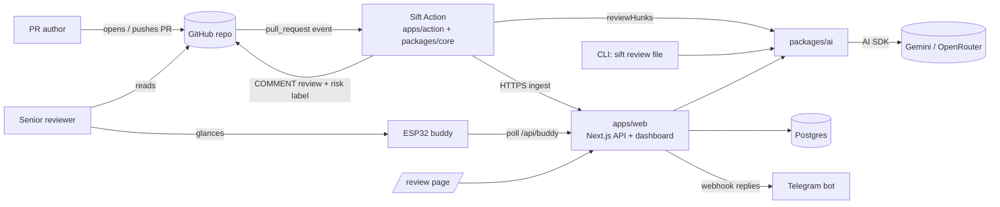
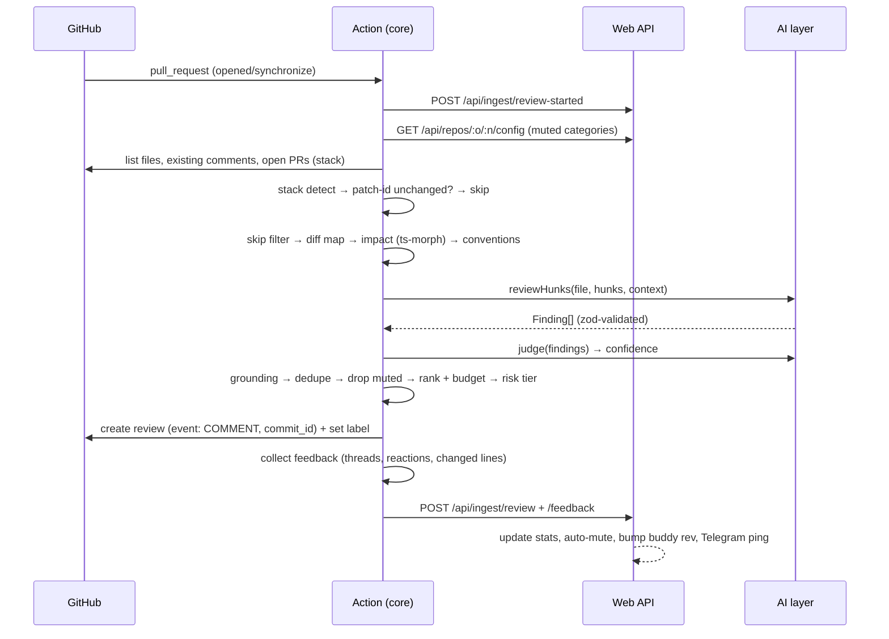

# ARCHITECTURE

## 1. System context



**Three entry points share one AI layer:** the CLI, the paste page and the Action. **One data hub:** `apps/web` owns the database. Everything else reaches it over HTTP.

## 2. PR review pipeline



Each step is a pure function or a thin I/O wrapper. That makes every stage unit-testable on fixtures without GitHub or an LLM.

## 3. Package boundaries

| Package | Owns | May import | Must not |
|---|---|---|---|
| `@sift/shared` | zod schemas, types, constants, fixtures, markdown renderers, `computeBuddyState` | `zod` only | Import any other workspace package; do I/O |
| `@sift/ai` | Provider, prompts, `reviewHunks`, `judge`, convention mining | `@sift/shared`, `ai`, provider SDKs, `ts-morph` | Call GitHub; know about PRs |
| `@sift/core` | Diff map, grounding, dedupe, rank, risk, stack, impact, feedback, GitHub I/O, ingest client | `@sift/shared`, `@sift/ai`, Octokit, `ts-morph` | Touch the database |
| `apps/action` | Entry point: reads env, calls `runPrReview()` | `@sift/core` | Contain logic (keep under ~50 lines) |
| `apps/cli` | Entry point: `sift review <file>` | `@sift/ai`, `@sift/shared` | Import `@sift/core` (keeps the CLI light) |
| `apps/web` | Next.js pages, API routes, Prisma, Telegram | `@sift/shared`, `@sift/ai` (paste page only) | Import `@sift/core` (keeps ts-morph out of the Vercel bundle) |
| `firmware/buddy` | ESP32 C++ | — (speaks JSON over HTTPS) | Hold any logic beyond rendering the mood it receives |

Working solo, these boundaries still pay off: each ticket stays inside one package, a coding agent can work on one package without breaking the others, and ts-morph stays out of the Vercel bundle. `pnpm check:boundaries` (T-01) fails CI if a package imports something it must not.

## 4. Folder structure

```
sift/
├─ .github/
│  ├─ pull_request_template.md
│  ├─ ISSUE_TEMPLATE/task.md
│  └─ workflows/{ci.yml, pr-hygiene.yml, sift-self-review.yml,
│                 deploy-smoke.yml, firmware.yml}
├─ apps/
│  ├─ action/            src/main.ts
│  ├─ cli/               src/index.ts
│  └─ web/               app/, app/api/, lib/, prisma/
├─ packages/
│  ├─ shared/            src/{schemas,constants,buddy}.ts
│  │                     src/fixtures/*.json
│  │                     src/render/{summary,inline}.ts
│  ├─ core/              src/diff/ src/validate/ src/dedupe/ src/rank/
│  │                     src/risk/ src/stack/ src/context/ src/feedback/
│  │                     src/github/ src/ingest/ src/pipeline/ src/config.ts
│  └─ ai/                src/{provider,review,judge}.ts
│                        src/prompts/{review,judge}.md
│                        src/conventions/{mine,render}.ts
├─ benchmark/            labels.json, runner/, results.md
├─ firmware/buddy/       platformio.ini, src/, include/
├─ docs/                 PRD, TRD, ARCHITECTURE, …
├─ scripts/{setup-repo.sh, ship.sh, check-boundaries.mjs}
├─ AGENTS.md             (rules for coding agents)
├─ .env.example
├─ biome.json
├─ package.json          (packageManager: pnpm@10)
├─ pnpm-workspace.yaml
└─ tsconfig.base.json
```

A separate repo, `sift-demo-shop`, holds the demo app and the 10 benchmark PRs.

## 5. Key decisions

| # | Decision | Why | Trade-off |
|---|---|---|---|
| D1 | Run as a **GitHub Action**, not a hosted GitHub App | No server for the review runtime; `GITHUB_TOKEN` gives scoped permissions for free | One repo at a time; the App is "what's next" |
| D2 | The Action **checks out the Sift repo and runs from source** (no committed `dist/`) | Avoids constant merge conflicts on generated bundles | ~30–60 s install per run; cached with pnpm |
| D3 | **Vercel AI SDK** + zod `generateObject` | Provider-agnostic; typed output, invalid JSON rejected | Slight abstraction overhead |
| D4 | **ts-morph** for impact analysis and conventions | Real "find references"; tree-sitter only gives syntax | TS/JS only |
| D5 | **Deterministic stages around a single LLM step** (grounding, dedupe, rank, risk are plain code) | Predictable, testable, cheap; the LLM can't post off-diff or spam | Less "magic" |
| D6 | **Hidden HTML markers** in comments for fingerprints and patch-ids | Dedupe across pushes without needing the DB | Markers visible in raw markdown (harmless) |
| D7 | **Web app is the only DB owner**; Action talks over HTTP | Pipeline never needs DB credentials; Action works even if the API is down | Needs a shared Bearer secret |
| D8 | **Server decides buddy mood**; firmware only renders | Tweak behaviour without reflashing; firmware stays tiny | Needs the network for new states (demo mode covers offline) |
| D9 | **Feature flags** via `SIFT_FEATURES` | Merge unfinished work daily; small PRs; cut features instantly | Some dead code while flags are off |
| D10 | **Biome** instead of ESLint + Prettier | One fast tool and one config, which is simpler for first-timers | Fewer plugins |

## 6. Data ownership

| Data | Source of truth | Consumers |
|---|---|---|
| Posted comments, labels | GitHub | Action (dedupe via markers) |
| Reviews, findings, outcomes, stats | Postgres via `apps/web` | Dashboard, Telegram, buddy, Action (`/config`) |
| Mined conventions | `.github/copilot-instructions.md` in the target repo | Sift, GitHub Copilot |
| Benchmark truth | `benchmark/labels.json` | Benchmark runner |
